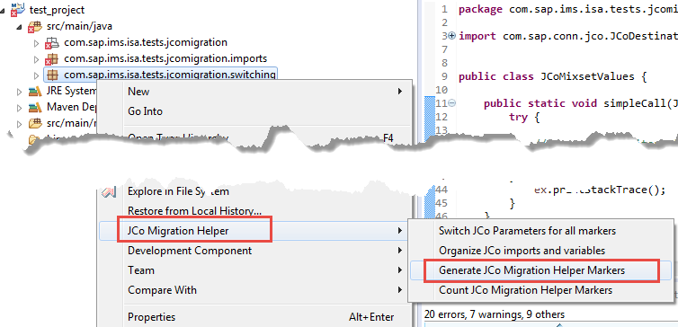
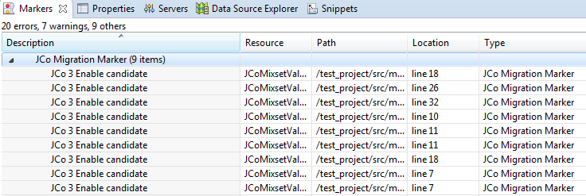
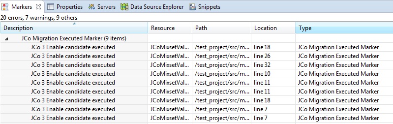
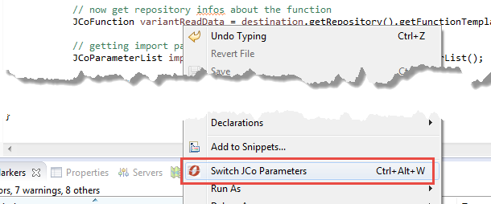

# JCo Migration Helper Plugin
The plugin JCo 3 Migration Helper Plugin is an eclipse/NetWeaver Studio plugin which helps developers to adapt the API changes from the Java Connector.

## Feature list

* Switch Parameters of the setValue calls
* Find all locations where the setValue calls must be switched
* Migrate JCo 2 imports/variable declarations/casts and much more with one click 

## Prerequisites

* Java 8
* Eclipse Mars or NWDS 

# Installation

Use the update site from **MISSING NOT AVAILABLE YET** to install the plugin.

# How to use it

## Find locations where the switch is required

Right click on the Java Project/Package/File and choose JCo Migration Helper --> Generate Markers

The plugin will go through your Java Classes and search for all variables using the setValue calls of JCo and mark them as a **Migration Candidate**. Open the Markers view to see the list of generated markers.

## Switch Parameters of the setValue calls

Right click on the variable and choose **Switch Parameters**.

The plugin will search for all occurrences of the variable, where the setValue method is invoked and switch the parameters. The marker will be deleted additionally after a successful switch.

The process for this is the following:

1. Right click in the package explorer 
1. Generate the Markers for all occurrences which must be migrated by choosing *JCo Migration Helper* --> *Generate JCo Migration Helper Markers*  
  
This will generate markers with all candidates for switching parameters.  
You can check out the markers using the *Markers* view in Eclipse.  

1. If the markers are correct then you can swtich all parameters at once by choosing *JCo Migration Helper* --> *Switch JCo Parameters for all markers*
1. The plugin will generate a different type of marker and remove the old one so that you can check out the changes made by the plugin.  


You can also go into every class manually and switch the parameters by clicking on the variable and select *Swtich JCo Parameters*  
  
It will add a marker that the switch was done for this variable.

### Logic of switching parameter candidates

The current logic for the candidates is:

* Goes through all Java Classes and tries to find variables/fields/method parameters which are from type  
    * JCoTable
    * com.sap.conn.jco.JCoTable
    * JCoStructure
    * com.sap.conn.jco.JCoStructure
    * JCoParameterList
    * com.sap.conn.jco.JCoParameterList
    * JCoRecord
    * com.sap.conn.jco.JCoRecord
* Is this java element using a setValue Method? e.g. getImportParameterList().setValue("NAME_1", "value_1");

Then this a candidate for the switch. 

## Migrate JCo 2 artifacts

Right click on the Java Project/Package/File and choose JCo Migration Helper --> Organize JCo Imports

It will go through your Java Classes and

* search for Old JCo 2 Class-Imports (com.sap.mw.jco\*) and change them to (com.sap.conn.jco.\*)
* Migrate variable and field declarations
* Migrate method parameters and return statements
* Migrate exceptions (catch clauses and throws statements)
* Migrate casts

A class which could look like this:

```java
package com.sap.ims.isa.tests.jcomigration.imports;

import com.sap.mw.jco.JCO;


public class OldJCoAllInOne {

    private com.sap.mw.jco.JCO.Function variantReadData;
    private JCO.Table table;

    public static void simpleCall(com.sap.mw.jco.JCO.Function func, JCO.Table table) throws Exception {
		try {

			JCO.Function funcInst = new JCO.Function();
			
			// now get repository infos about the function
			JCO.Function variantReadData = connection.getJCoFunction("CRM_ISA_PCAT_VARIANT_DATA_GET");

			// getting import parameter
			com.sap.mw.jco.JCO.ParameterList importParams = variantReadData.getImportParameterList();

			// setting the id of the attribute set
			importParams.setValue("valueCatalog", "CATALOG");
			importParams.setValue("valueVariant", "VARIANT");

			// call the function
			connection.execute(variantReadData);

			// get the output parameter
			JCO.ParameterList exportParams = variantReadData.getExportParameterList();

			String returnCode = exportParams.getString("RETURNCODE");

		} catch (JCO.Exception | JCO.Exception ex) {
			ex.printStacktrace();
		}
		
		try {
		    throw new JCO.Exception();
		} catch (com.sap.mw.jco.JCO.Exception ex) {
		    ex.printStacktrace();
		}
	}
    public JCO.ParameterList simpleCall(JCO.Function func) throws JCO.Exception {
        return (JCO.ParameterList) null;
    }
    public com.sap.mw.jco.JCO.ParameterList simpleCallFqn(com.sap.mw.jco.JCO.Function func) throws JCO.Exception {
    	return (com.sap.mw.jco.JCO.ParameterList) null;
    }
    public com.sap.mw.jco.JCO.ParameterList simpleCallNoException(com.sap.mw.jco.JCO.Function func) {
    	return (com.sap.mw.jco.JCO.ParameterList) null;
    }
}
```
would look after migration like this:
```java
package com.sap.ims.isa.tests.jcomigration.imports;

import com.sap.conn.jco.*;


public class OldJCoAllInOne {

    private com.sap.conn.jco.JCoFunction variantReadData;
    private JCoTable table;

    public static void simpleCall(com.sap.conn.jco.JCoFunction func, JCoTable table) throws Exception {
		try {

			JCoFunction funcInst = new JCoFunction();
			
			// now get repository infos about the function
			JCoFunction variantReadData = connection.getJCoFunction("SOME_FM");

			// getting import parameter
			com.sap.conn.jco.JCoParameterList importParams = variantReadData.getImportParameterList();

			// setting the id of the attribute set
			importParams.setValue("value_1", "NAME_1");
			importParams.setValue("value_2", "NAME_2");

			// call the function
			connection.execute(variantReadData);

			// get the output parameter
			JCoParameterList exportParams = variantReadData.getExportParameterList();

			String returnCode = exportParams.getString("RETURNCODE");

		} catch (JCoException | JCoException ex) {
			ex.printStacktrace();
		}
		
		try {
		    throw new JCoException();
		} catch (com.sap.conn.jco.JCoException ex) {
		    ex.printStacktrace();
		}
	}
    public JCoParameterList simpleCall(JCoFunction func) throws JCoException {
        return (JCoParameterList) null;
    }
    public com.sap.conn.jco.JCoParameterList simpleCallFqn(com.sap.conn.jco.JCoFunction func) throws JCoException {
    	return (com.sap.conn.jco.JCoParameterList) null;
    }
    public com.sap.conn.jco.JCoParameterList simpleCallNoException(com.sap.conn.jco.JCoFunction func) {
    	return (com.sap.conn.jco.JCoParameterList) null;
    }
}

```